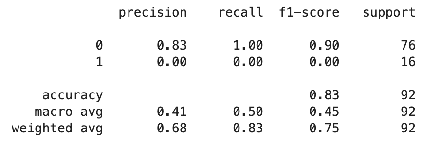
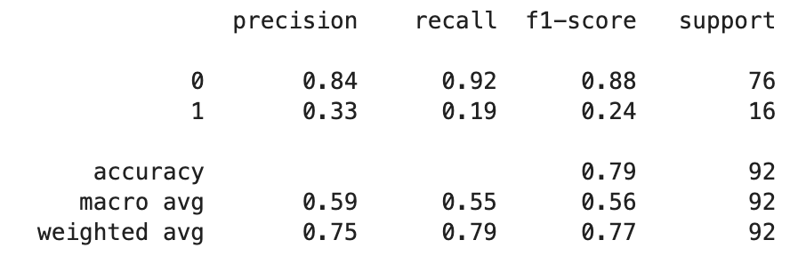
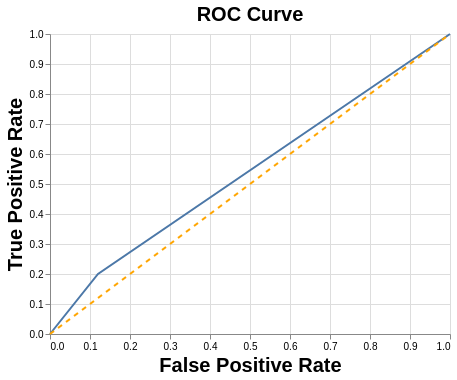

Autism Spectrum Disorder Screening Machine Learning Analysis
================
Matthew Connell, Thomas Pin and Tejas Phaterpekar
22/01/2020

# Summary

Here we trained several machine learning models from the `sklearn` package in the Python programming language in attempt to find a model that would better and more quickly diagnose autism in adults. We used survey data from the UCI Machine Learning Datasets repository.

The survey data we used consisted of ten questions in addition to other information about the respondent, such as age and country of residence. We looked into whether there were questions that could be disregarded from the survey without having a negative impact on the accuracy of diagnosis.

We eventually chose a Decision Tree Classifier as our model. However, even though we had decent results on training and validation data, our model was poor at predicting outcomes on our test data. 

# Introduction

Autism Spectrum Disorder (ASD) is a complex neurodevelopmental condition
that impairs social interpretation/communication ability, as well as the
presence of repetitive behaviors. Current diagnostic procedures are
lengthy and inefficient (Thabtah 2019). Affecting 1.5% of the
population, with many more cases going undetected, an easy-to-implement,
effective screening method is warranted. ASDTest, a mobile app, has been
introduced to provide an accessible screening method that tells the user
whether they should seek formal healthcare opinions, based on a 10
question survey (Allison, Auyeung, and Baron-Cohen 2012). The ability to
recognize and diagnose ASD at an early age can allow the affected to
access the healthcare resources and support they will need, in a timely
manner.

The Autism Spectrum Quotient-103
([AQ-10](https://www.nice.org.uk/guidance/cg142/resources/autism-spectrum-quotient-aq10-test-pdf-186582493))
consists of 10 questions intended to differentiate characteristics of
autism in individuals. Each question has four possible answers:
“Definitely Agree”, “Slightly Agree,”Slightly Disagree“,
and”Definitely Disagree“. For questions 1, 5, 7, and 10, a value of 1
is assigned for either a”slightly agree" or a “definitely agree”
response. For questions 2, 3, 4, 6, 8, and 9, a value of 1 is assigned
for either a “slightly disagree” or a “definitely. disagree” response. A
cumulative score is calculated for each individual, which is then used
to recommend a healthcare opinion. An individual who receives a total
score of greater than 6 is recommended for a specialist diagnostic
assessment.

Using this metric, the ASD app has the following performance.

Currently, all 10 prompts have equal importance in the app’s
classification process. Our project aims to explore which survey
questions are the most effective predictors. Could those be weighted
more heavily in future ASD predictions? Additionally, are these survey
questions more useful in our models, compared to an individual’s
background (age, gender, ethnicity)?

# Methods

## Data

The
[dataset4](https://archive.ics.uci.edu/ml/datasets/Autism+Screening+Adult)
used in this analysis was obtained from the University of California
Irvine Machine learning Repository5, uploaded by Fadi
Thabtah. Each row represents an individual who participated in the
survey. The survey’s results, the app’s classification, and some
background information about the indvidual was
recorded.

| Variable                 | Type             | Description                                                                                                                            |
| ------------------------ | ---------------- | -------------------------------------------------------------------------------------------------------------------------------------- |
| A1\_score                | Int (0,1)        | Prompt: I often notice small sounds when others do not                                                                                 |
| A2\_score                | Int (0,1)        | Prompt: I usually concentrate more on the whole picture, rather than the small details                                                 |
| A3\_score                | Int (0,1)        | Prompt: I find it easy to do more than one thing at once                                                                               |
| A4\_score                | Int (0,1)        | Prompt: If there is an interruption, I can switch back to what I was doing very quickly                                                |
| A5\_score                | Int (0,1)        | Prompt: I find it easy to ‘read between the lines’ when someone is talking to me                                                       |
| A6\_score                | Int (0,1)        | Prompt: I know how to tell if someone listening to me is getting bored                                                                 |
| A7\_score                | Int (0,1)        | Prompt: When I’m reading a story I find it difficult to work out the characters’ intentions                                            |
| A8\_score                | Int (0,1)        | Prompt: I like to collect information about categories of things(e.g. types of car, types of bird, types of train, types of plant etc) |
| A9\_score                | Int (0,1)        | Prompt: I find it easy to work out what someone is thinking or feeling just by looking at their face                                   |
| A10\_score               | Int (0,1)        | Prompt: I find it difficult to work out people’s intentions                                                                            |
| Age                      | Int              | Age of the individual                                                                                                                  |
| Gender                   | String           | M (male) or F (female)                                                                                                                 |
| Ethnicity                | String           | Common Ethnicities defined for each individual                                                                                         |
| Born with Jaundice?      | String (yes,no)  | Was individual born with jaundice?                                                                                                     |
| Country of Residence     | String           | Home country of individual                                                                                                             |
| Used app before?         | String (yes, no) | Has the user has used a screening app                                                                                                  |
| Result                   | Int              | Cumulative score of the 10 survey Q’s                                                                                                  |
| age\_desc                | String           | Age Group                                                                                                                              |
| relation                 | String           | Parent, self, caregiver, medical staff, clinician ,etc.                                                                                |
| ASD/Class                | String (yes, no) | App’s classification based on result                                                                                                   |
| autism (Target Variable) | String (yes, no) | Does individual have an autism diagnosis?                                                                                              |

## Analysis

The following \_\_\_ models were used. We dropped the following \_\_\_
variables before fitting our models. GridSearchCV was used to optimize
parameters (maybe use the markdown variables to report any
hyperparameters)

### Choosing a model

For the analysis, the training data was split into a train set and a validation set. Using these sets of data, we conducted a grid search with cross validation over five different type of models (Logistic Regression, K-Nearest Neighbors, Random Forest Classifier, Decision Tree Classifier, and Support Vector Machine classification). We used `recall` as the scoring method as our goal was not to get the most accurate model, but to get the model that reduced the number of false negatives. Additionally, there was the issue of class imbalance as our dataset consisted mostly of people who were not diagnosed with Autism. Merely choosing accuracy as our goal would have made the model predict only negative outcomes. 

The model with the best precision was found to be a `Decision Tree Classifier` with parameters `max_depth` equal to 20 and `max_features` equal to 50. The classification report on the validation set for this model is below. The recall score is 0.38.

### Improving the model

One of the goals of this project was to find which questions on the survey would best predict the diagnosis of Autism and whether or not any of the questions from the survey could be dropped without reducing accuracy. This would help streamline the diagnosis process and save time for everyone.

#### Forward Selection

An attempt at choosing the best questions was made using the feature selection concept of `forward selection`, where a model chooses the feature that best predicts the validation set, and then the next best feature is chosen. However, it was determined that no one question was better than another at predicting the outcomes, so `forward selection` was not useful. 

#### Recursive Feature Elimination

We tried another method of feature selection called `recursive feature elimination`, which looks at all features and then eliminates the one that is the least helpful in predicting the target features. This is done until the desired number of features is selected. 

The 'best' questions found by `RFE` were questions 4, 5, 6, 8, and 10.

However, when fitting a new `Decision Tree Classifier` with only these features, the recall score got worse on both the training set and the validation set.  See the classification report for the top fice questions below:

Similarly, choosing all the questions as features and no other features yielded worse results than our initial model.

### Final Results

After selecting a model with grid search cross-validation and finding the best features, we used our Decision Tree model to predict results on our test set. Unfortunately, the recall score was far below that of our validation set. 

Classification report of final model on test set:

A recall score of 0.07 is worse than we were expecting. 

ROC curve:

In future research, we should look into increasing the sensitivity of the model against false negatives, contact domain experts for assistance in feature engineering, and delve deeper into hyperparameter optimization. 

### Code attribution

The following programming were used for this project: Python (Van Rossum
and Drake 2009) and R (R Core Team 2019). The following R packages were
used: tidyverse(Wickham 2017),knitr(Xie 2014), and reshape2. The
following Python packages were used:docopt, zipfile, pandas, urllib,
requests, sklearn, numpy, scipy.

# Results & Discussion

1.  Start with commenting about exploratory plots (insert Thomas’ EDA
    plots)

2.  Talk about the results of ML (perhaps a table of performance, or
    another visual if we are feeling creative)

# Limitations/Assumptions

There were 131 rows that contained “?” or “other” values in the
“country\_of\_res”, “relation”, and “age” columns. It is possible that
“?” values resulted in participants not filling aspects of the survey.
We were unable to easily fill these values without feeling like we would
bias our results. Instead, we opted to remove these rows entirely and
only use the remaining data. This limits our study because we did lose
(18%) of the original data that could had a potential influence on our
model.

Our original intention was to use survey data from children,
adolescents, and adults. However, we were unable to access the survey
questions used for the Child-AQ-10 and Adolescent-AQ-10, which are
different to the Adult-AQ-10 question. As a result, we were limited to
addressing questions that focused on solely on adults.

# References

Allison, Carrie, Bonnie Auyeung, and Simon Baron-Cohen. 2012. “Toward
Brief ‘Red Flags’ for Autism Screening: The Short Autism Spectrum
Quotient and the Short Quantitative Checklist in 1,000 Cases and 3,000
Controls.” *Journal of the American Academy of Child & Adolescent
Psychiatry* 51 (2). Elsevier: 202–12.

R Core Team. 2019. *R: A Language and Environment for Statistical
Computing*. Vienna, Austria: R Foundation for Statistical Computing.
<https://www.R-project.org/>.

Thabtah, Fadi. 2019. “An Accessible and Efficient Autism Screening
Method for Behavioural Data and Predictive Analyses.” *Health
Informatics Journal* 25 (4): 1739–55.
<https://doi.org/10.1177/1460458218796636>.

Van Rossum, Guido, and Fred L. Drake. 2009. *Python 3 Reference Manual*.
Scotts Valley, CA: CreateSpace.

Wickham, Hadley. 2017. *Tidyverse: Easily Install and Load the
’Tidyverse’*. <https://CRAN.R-project.org/package=tidyverse>.

Xie, Yihui. 2014. “Knitr: A Comprehensive Tool for Reproducible Research
in R.” In *Implementing Reproducible Computational Research*, edited by
Victoria Stodden, Friedrich Leisch, and Roger D. Peng. Chapman;
Hall/CRC. <http://www.crcpress.com/product/isbn/9781466561595>.

